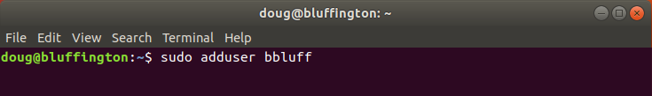
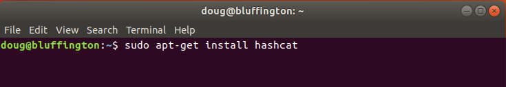
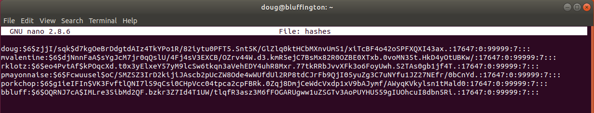
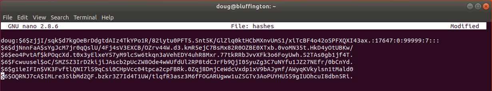
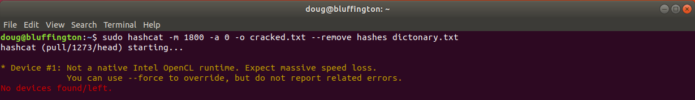
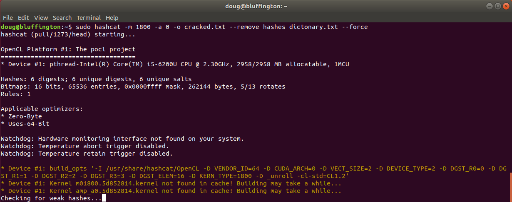
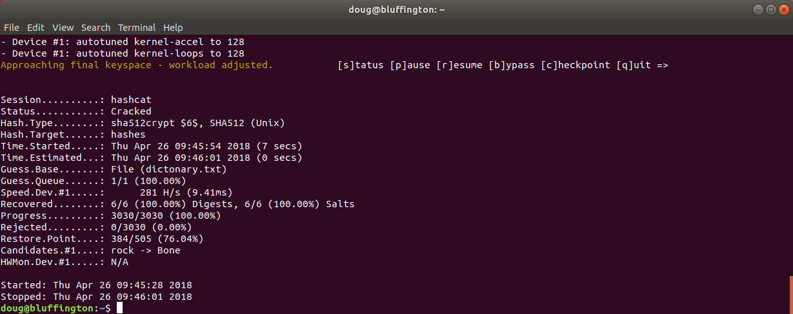
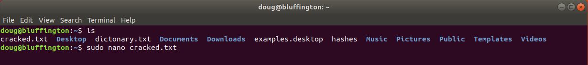
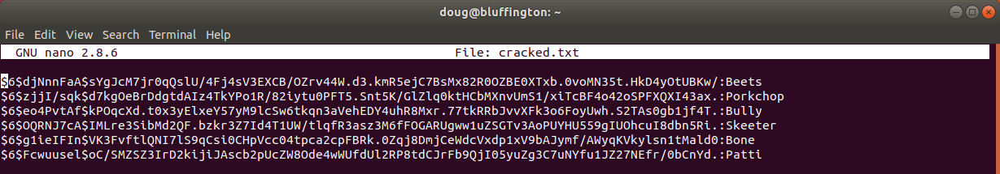

= Dictionary Attack With Hashcat

Author: Nick Bordine

== Intro

How to get hashes, analysize then, and how to perform a simpl dictionary attack using hashcat to crack them.

== Prerequisites

VirtualBox

Ubuntu Virtual Machine

Alternative: Kali Virtual Machine

Hashcat

== Instructions

. Boot up your machine and create some users.



+
. Install hashcat.



Copy that line if your using Ubuntu.

Kali should already have hashcat installed.

+
. Get your hashes from /etc/shadow

image::tail.png[]

This prints out the users and their hashes in your terminal.

We want to get this to a file for use in a bit.

To do this wee need to enter the following command.

	sudo tail /etc/shadow > hashes
	
This creates a text file containing the hashes in the current directory.

+
. Dissecting the hashes

```
sudo nano hashes
```

To view the contents of hashes, and you should see something similiar to:



Using the entray for doug, lets break down the parts of the hash we're interested in for this tutorial.

```
	doug:		is the user
	$6$			is the prefix, in our case it tells us that its SHA-512
	$z ... k$	is the salt
	$d ... .	is the hashed text
```	

+
. Edit your hashes

Now we want to edit the hashes to look like the entries below the user doug.



Now you need to be careful on what you are deleteing.

Using the image above, delete *user*:, or the characters up to the first $.

The second part that needs to be deleted is at the end, statring at the first : and to the last : on the line.

Your text file should now look like the other five lines.

If this isn't done, hashcat won't reconize them as hashes.

Control X to save, and yes to keep the changes.

+
. Get your wordlist

I recommend rockyou.txt from https://wiki.skullsecurity.org/Passwords, it contains a huge list of stolen credentials.

+
. Cracking

The following screenshots show you the necessary commands.






Breaking down the command.

```
	-m 1800				our hash mode
	-a 0				dictionary attack
	-o cracked.txt		output results to a file
	--remove			removes the hash as its found
	hahses				file with the hashes
	dictionary.txt		the wordlist your using
	--force				forces the cracking if you don't have native Intel OpenCL
```

Sit back at this point as it may take some time to finish, but it should like like the following screenshot when done.



+
. View your results




All that's left is to matched the cracked hashes to the users.

== Challenge

Provide some meaningful ways for the learner to apply their knowledge in a new way.

== Reflection

Provide some thought questions that help the learner make sense of how the tutorial fits in the bigger picture.
