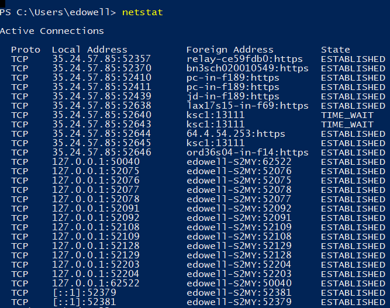
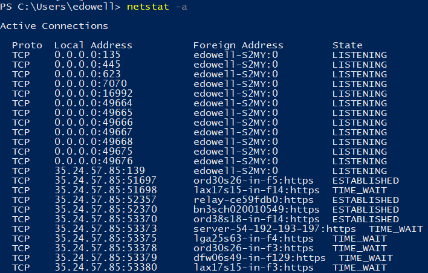
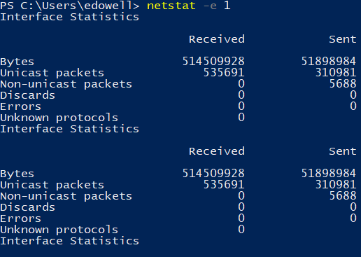
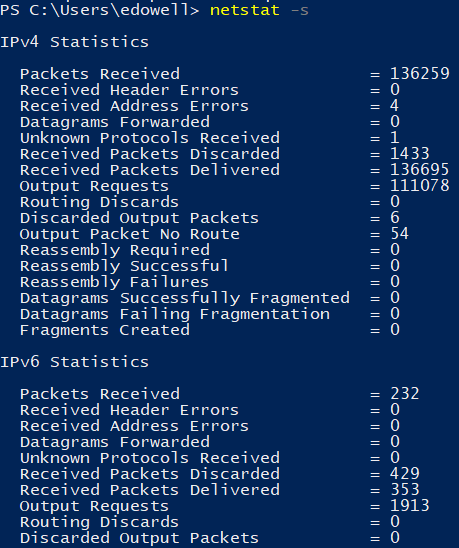
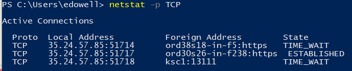
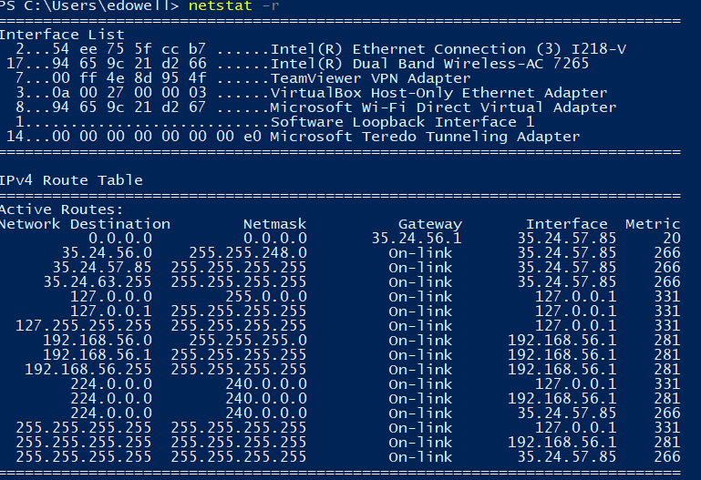
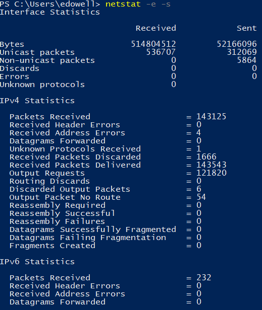

= Netstat Tutorial
By: Emerson Dowell

== KAHHMAAYYHAAAA  INTRO

Okay for this tutorial we are going to learn about how to monitor your traffic to an extent and check open/closed ports using the 'netstat' command inside of CMD -or- Powershell.

[quote, Computer Hope's Free Computer Help, www.computerhope.com/netstat.htm]
____
*Quote* The netstat command is used to display the TCP/IP network protocol statistics and information.
____

.Netstat Commands
* [-a] Connections & Listening Ports
* [-b] Executables involved in creating connections or listening ports.
* [-e] Ethernet Statistics
* [-f] Fully Qualified Domain Names
* [-n] Addresses and ports numerically
* [-o] Process ID's associated with connections
* [-p][-IP,-IPv6,-ICMP,-ICMPv6,-TCP,-TCPv6,-UDP or -UDPv6] Shows connections for the protocol given. May be combined with -s
* [-r] Displays Routing Table
* [-s] Shows per-protocol statistics; May be combined with -p
* [-t] Displays current offload state
* [-x] NetworkDirect Connection Information
* [-y] TCP template for all connections
* [0-#] You may append any whole number to the end of a finished to have that command reapeat every # seconds.

== Prerequisites

1. A nintendo powerglove
2. A hand
3. A skateboard
4. Glasses
5. A can of awesome
6. Windows Operating System

== Instructions

IMPORTANT: Ollie in with your skateboard. Equip your powerglove by pulling it onto your hand with vengeance. Press buttons. Do a striking pose into the camera and very slightly adjust your glasses right before taking your can of awesome, cracking it open and taking a sip. Then say 'Delicous'.

=== Step 1: Press WIN + R.

NOTE: This is the key combination to open RUN where you can type in program names or CMD / Powershell commands on the fly.

=== Step 2: Type *powershell* -or- *cmd*, press enter.
NOTE: This will open a Command Line Interface to interact with which we will be using for the rest of this tutorial. You can press ctrl+c at any time while a command is running to cancel it and get input functionality again.

=== Step 3: Type *netstat*
TIP: Displays all the current connections.

=== Step 4: *netstat -a* 
TIP: Displays all the connections and listening ports.

=== Step 5: *netstat -e 1*
TIP: Displays ethernet statistics and will refresh every 1 second.

=== Step 6: *netstat -s* 
TIP: Shows all of the connections pertaining to TCP, UDP, TCPv6 or UDPv6.

=== Step 7: *netstat -p TCP* 
TIP: Shows all of the connection pertaining to TCP. You may replace 'TCP' with IP, IPv6, ICMP, ICMPv6, TCPv6, UDP, or UDPv6.

=== Step 8: *netstat -r*
TIP: Shows the routing table.

=== Step 9: *netstat -e -s*
TIP: This will display ethernet statistics for ALL ports.
NOTE: This is an example of how you may append multiple (-) commands to the netstat command.

Well by now you should be pretty used to netstat & the information it shows you. I hope you found this tutorial helpful and *The Last Jedi is the worst movie ever made IMO*.!
----
Netstat comes with many different letters / letters you can append to the end of the command. NETSTAT [-a] [-b] [-e] [-f] [-n] [-o] [-p proto] [-r] [-s] [-x] [-t] [interval]
----

== Challenge

Apply what you have learned to make a quick and easy powershell script to monitor your network!

== Reflection

What type's of conditions could you make use of netstat?

Would netstat be useful to troubleshoot programatic networking issues?

Would netstat be effective to spot any unwanted / malicous connections on your network?