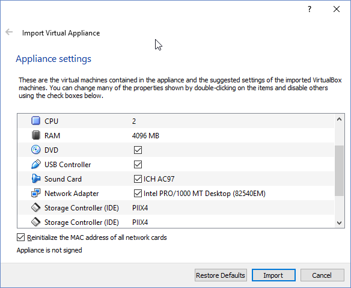

= Basic Penetration Testing

Author: Matt Hoff

== Intro

Describe the goals and purpose of the tutorial here.
The goals and purpose of this exercise are to introduce the
reader to the world of penetration testing using an easy vulnerable
virtual machine. They will a few different tools inside kali to "boot2root"
the machine.


== Prerequisites

The "*" is a bulleted list.

* VirtualBox
* Kali Virtual Machine
* Basic Pentesting: 1 by Josiah Pierce from https://www.vulnhub.com/entry/basic-pentesting-1,216/[Vuln Hub]

== Instructions

Guide the person through the steps. Starting a line with a period is an automatically numbered list.

=== Setup Vulnerable Machine and Kali

. Download and install vulnerable machine.
. To install it just double click ova file in the folder to import virtual appliance
. Click the "Reinitialize the MAC address of all network cards", sand then click import. 
+

. In Virtualbox make sure that the network adapter for both of the VMs are set to "Host-only Adapter"
. In Virtualbox start the Kali Linux and the csec

=== Game Time

. Step three. Use "+" and the  backtick character to add additional command.
+
```
sudo su
```
. Step four. Use the following syntax to include screenshots or other images.
+
image::blue-rectangle.png[]
. Step five. Compile with the following command:
+
```
asciidoctor-pdf tutorial.adoc
```

== Challenge

Provide some meaningful ways for the learner to apply their knowledge in a new way.

== Reflection

Provide some thought questions that help the learner make sense of how the tutorial fits in the bigger picture.
