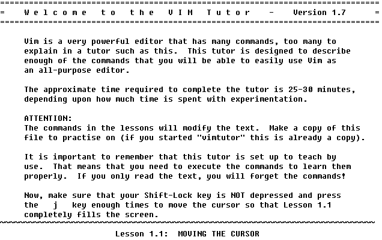

= Introduction to Vim Text Editor 

Author: Meredith Miller

== Intro
Vim is a text editor that can take some time to get accustomed to. It is very useful if you know 
the commands behind it. There are many ways to learn Vim and the commands. There are different
tutorials and even games you can play to learn the effectiveness of the editor. Vim takes a long
time to understand and become efficient with. This tutorial will walk you through how to begin 
learning Vim. 

In this tutorial, you will learn the basics of Vim through Vim Adventures and other tutorials. 
Learning Vim can take as long or as short as you want it to take. There are people who have spent the last 
5 years learning Vim and are still learning new things.The main learning objectives are:

* How to save and exit Vim
* First 3 levels of Vim adventures 
* Walking through the tutorial included in Vim

== Prerequisites

* Working Computer
* Vim downloaded
* Internet Access

== Instructions

. Go to https://www.vim.org/download.php and download the latest version of Vim. 
. Go to https://vim-adventures.com/ (This is Vim Adventures- the first three (3) levels are free for anyone to play)
. Go through the first three levels of Vim Adventures. This will give you a good feel how how to maneuver in Vim. To continue past the third level, you have to pay $25.
. Maneuver to your Vim files. For example C:\Program Files(x86)\Vim\Vim80\tutor This should solidify the commands learned in Vim Adventures, and expand on them as well.
. Work your way through the Vim tutor. Remember that you are not going through the tutor to just read, actually do the commands that it is telling you to do. This will significantly help you learn Vim. 
. The image below shows the introduction to the Vim Tutor.

+

== Challenge

Open up a text file in Vim and attempt to edit it with the commands you know. Play around and see what other actions you can discover.

== Reflection

Do you think that with your new knowladge of Vim, you will swap from using your current text editor to using Vim?
What are some of the advantages of using Vim other another text editor?
Can you think of any flaws of Vim?
