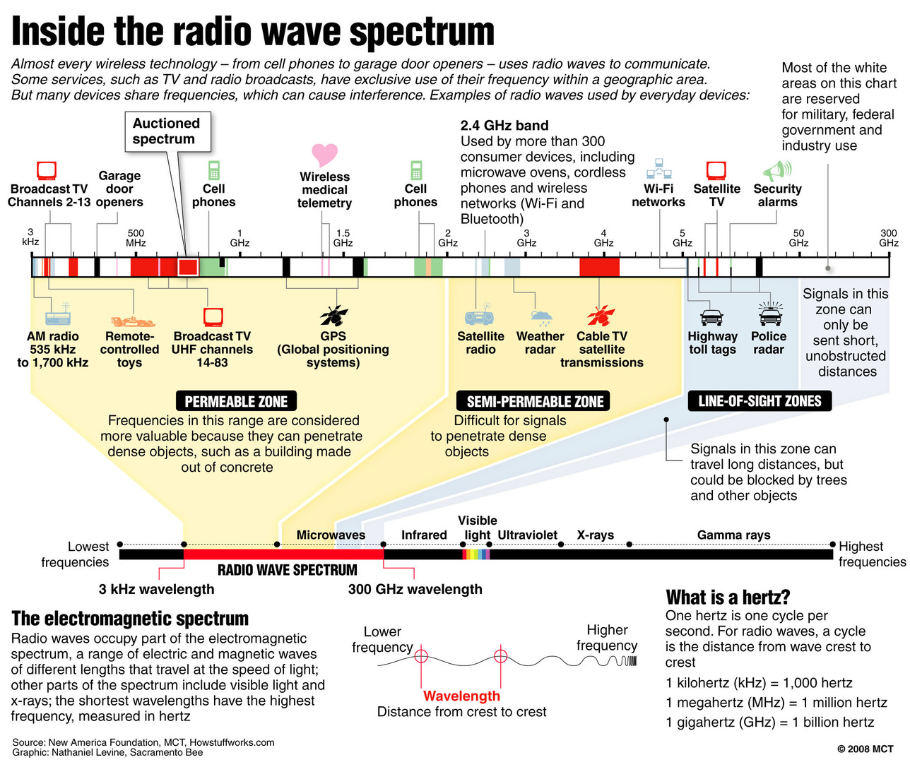
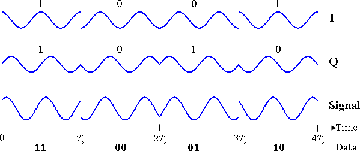
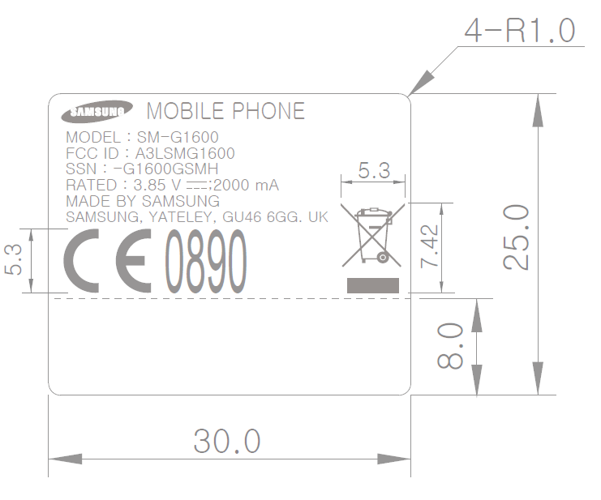
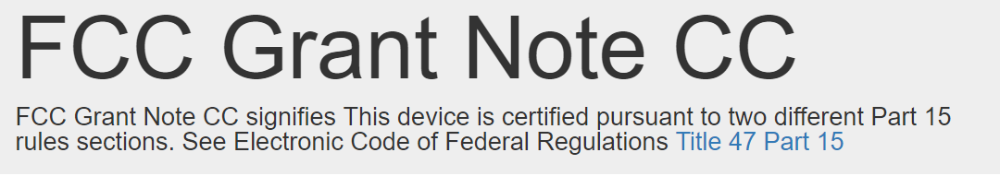
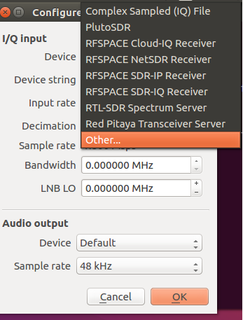
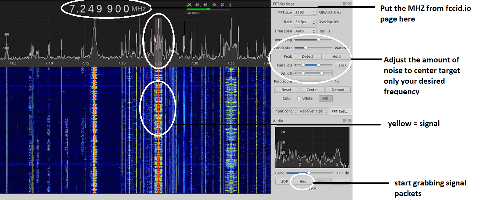
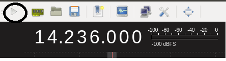
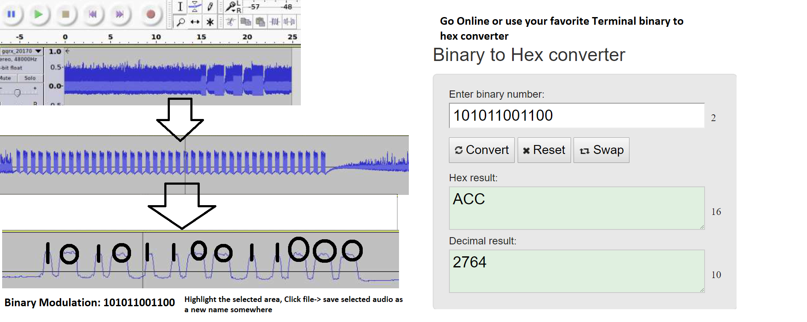
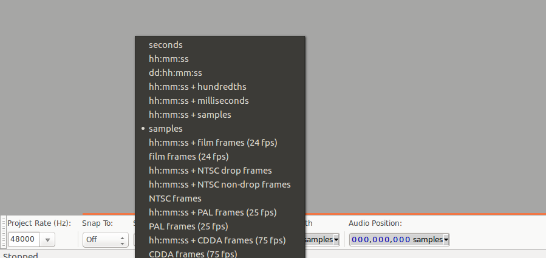

= Simple Radio Frequency Penetration testing

Author: Christopher Moore

== Intro
	* Hacking into every day devices through non-standardized network administration of various electromagnetic frequencies 
	* There are many tutorials out there for RF modifications or Li-fi but this tutorial will just demonstrate the basics and definitions of whats going on for a noob.

== Prerequisites

	* VirtualBox
	* Kali Virtual Machine(recommended) Or Some other Linux distro
	* Choose one: YARD Stick One(cheapest), HackRF, or Ubertooth one, or RTL-SDL
	* A device within the range of non-lethal wavelength(i.e cell phone, radio, car) 
	* linux packages described later
	* Audacity
	* read http://www.radio-electronics.com/info/rf-technology-design/pm-phase-modulation/what-is-psk-phase-shift-keying-tutorial.php
	** This includes documentation on basic binary booleans or peaks in signals
	* Catch up on Wavelengths: https://en.wikipedia.org/wiki/Wavelength
	* RfCat(kali recommended
	)
== cheat sheet

```
Full Spectrum
```



== Instructions

Guide the person through the steps. Starting a line with a period is an automatically numbered list.

. Step one(Getting to know the wavelengths and modulation).

.. The thing to know is that you can go in depth how ever you feel but the only real background you need to know in basic radio hacking is Modulation
	

	
.. In this image we see basically fluctuations in signals, our goal is to capture those packets and replicate them.
.. This type of attack is known as replay attacks, which is the simpliest form and the hardest to accomplosh normally without some guide. It requires experimenting like a radio to tap into the frequency your looking for to channel out unwanted noise and focus only on the main target device wavelength.
	
. Step two.

.. what your going to need first is to run sudo apt-get update in your unix enviroment terminal
.. next you will need to search either from a provide github software like:
+
```
hackerRF sweeper: https://github.com/pavsa/hackrf-spectrum-analyzer
Linux (beta - only ubuntu tested):
sudo apt install build-essential ant git libusb-1.0 libfftw3 libfftw3-dev openjdk-8-jdk
git clone --depth=1 --recurse-submodules https://github.com/pavsa/hackrf-spectrum-analyzer.git
cd hackrf-spectrum-analyzer/src/hackrf-sweep/
make
build/hackrf_sweep_spectrum_analyzer.sh 
```
+
.. or GQRX-Reciever and Rfcat-transmitter
.. this will also requiure Audacity
	
.. first install the add repository
+
```
sudo apt-get install software-properties-common python-software-properties
```
.. next install the software
+
```
sudo add-apt-repository -y ppa:bladerf/bladerf
sudo add-apt-repository -y ppa:myriadrf/drivers
sudo add-apt-repository -y ppa:myriadrf/gnuradio
sudo add-apt-repository -y ppa:gqrx/gqrx-sdr
sudo apt-get update
```
+
IMPORTANT: install in order as shown
* next install the software
```
sudo apt-get install gqrx-sdr
```
+
.. Optional Suggested Ubuntu packages
.. NOTE: This will take a couple of minutes 	
+
```
sudo apt-get install libvolk1-bin volk_profile 
```
.. Note: Vector Optimized for Kernals or VOLK is used for optimizing a large number of processes running on your computer, if your running a VM or not sniffing more than one packet you will not need this
	
. Step three. Find the frequencies listed on the FCC website

.. http://fccid.io/ : This is a required list 
+

.. Keep in mind the laws and rights listed on the side of your model, these contain rules on whether this would be considered jamming or not
.. jaming is when you tamper with the connnection rate of radio or wifi waves across a public space, its considered a form of ddos
+


. Step four. Start gqrx
.. this program is for analyzing radio frequencies with a graphical view
.. make sure your device adapter has the documented device drivers installed and that if your using a virtual machine like kali that you have selected NAT or Bridged mode with the selected adapter. 
+
```
gqrx
```
+

.. Here you will select the device to pick up the radioSignals
. Step five. Find the signal and grab the abnormalities
* you should get a very complicated gui with a random analyzer like shown below. I took the liberty of circling and labeling all you will need for this tutorial
+

*source: http://gqrx.dk/ gqrx homepage
..I have noticed that sometimes the gqrx looks different on operating systems and versions: make sure your aware and locate the FFT
* FFT - fast Fourier transform, allows analysis of signals over a certain period of time
..make sure you click the play button in the top right to start scanning packets
+

..make sure that also your device is transmitting, if its a keyflob for a car door lock you must keep the button pressed down
..if the signal is not narrowing down to a reasonable size, it may not be advertising over the exact Mhz signal, click on the mhz and use the arrow keys to push the mhz up or down
..once you've done that click the rec button and on your terminal you should see the directed file path. Open this in audacity 
image::path.png

.step six convert audio
+

* you will have to do this will most of the wave you grabbed rather than the just a single wave 
* another tool you might wanna use is the open source tool ooktools which using that same wave file you grabbed
+
```
ooktools wave binary --source yourWave.wav
```
* this will give you the binary as well.

.step seven hard part
* we now need to get the data rate for a tool called rfcat\
* the separate signals you found the binary to hex jumps is called On-Off Keying
* you will need this formula baud = (1.0 / (length of shortest high peak / sample rate))
* In audacity you have these numbers below, youll want to change it from second or whatever it is to samples
+ 

* now locate the smallest peak wave and select that
* at the bottom it translates to sample rate|length of peak|blank(dont need it)
* that new baud stands for bits/second

.step eight rfcat
.. rfcat is a python based script so you will need the appropriate device installation drivers found below
+
```
https://github.com/atlas0fd00m/rfcat
```
.. I will demonstrate lines for yardstick courtesy of Hack5 Documentation on yardstick 
+
```
wget https://bitbucket.org/atlas0fd00m/rfcat/downloads/rfcat_150225.tgz
tar zxvf rfcat_150225.tgz
cd rfcat_150225
sudo apt-get install python-usb
sudo python setup.py install
sudo rfcat -r
```
* at this point you will need the dongle to get access to it. 
* Side note there also are pre-made scripts since this is a python module you can use but I will show you what you would need for RFcat minim 
+
```
d.setFreq(#####) - fccid.io
d.setMdmModulation(MOD_ASK_OOK) - for setting On-Off-Keying
d.setMdmDRate(####) -Your baud rate
d.RFxmit(""*rateOfBinarySet) -your hex from binary and the amount of times you wish to tested
```

== Ref
	* https://www.eetimes.com/document.asp?doc_id=1276362
	* https://www.mathworks.com/help/matlab/matlab_external/baudrate.html
	* http://www.endmemo.com/convert/data%20transfer.php
== Challenge
.Mobile
..now that you have a understanding of basic packet sniffing and replaying outside of your typical wireshark try getting the signals of other devices
..Try figuring out the same method with mobile, this serves a challenge as you have both the device itself that runs on a different kind of frequency standard called GSM
..You also have the encrypted radio tower information located in the sim card fccid
* Hint
image::hint1.png
..if you look up any specs of phones you can see the information without having to sort through the fccid page which mixes all carrier models
.Light
..try experimenting with sending signals with to light devices such as IR or LDR(light dependent resister)
== Reflection
This type of hacking is widely use today to access car keys and intercept phone sms for decrypting messaging.
As time goes by you might wonder if this information is out of date, the answer is yes and no. You cannot replace the transmission of the entire electromagnetic spectrum
at the current moment our fastest transfer speeds are run off light signals known as fiber optics. As you can see our redirection of scattered data is getting better but in till then we will always require low level electronics or transmissions to prevent hacking
hence why car keys are still being used. The more underpowered you make a device the lower the storage such as nfc cards which having a purge timer that wipes the device clean after a certain time.
So learning these skills of electromagnetic wave hacking is a unmatched a skill that goes unexpired in an ever evolving era of technology. 
